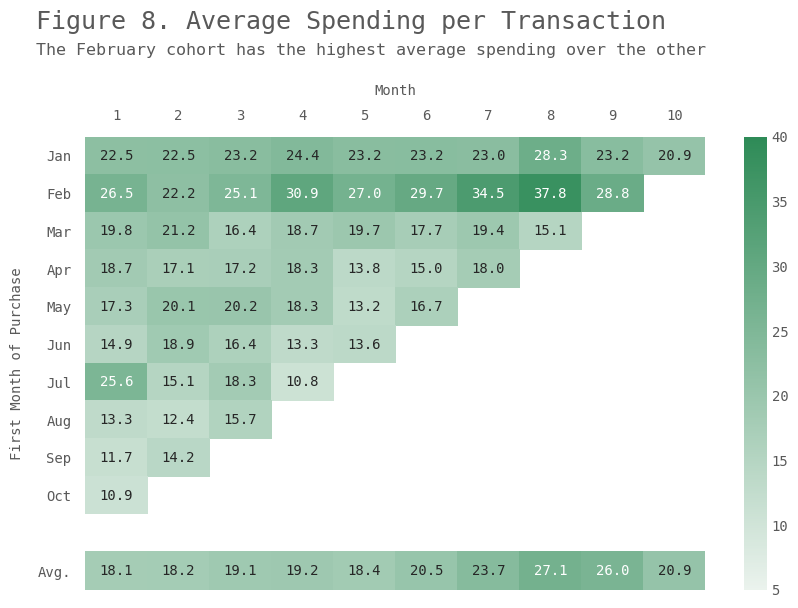

# It’s Always About the Customer - Customer Behavior Analysis

phto: unsplash
## Table of Contents

* [Introduction](#Introduction)
* [Exploratory Data Analysis](#Exploratory-Data-Analysis)
* [Customer Base Formation & Analysis](#Customer-Base-Formation-&-Analysis)
* [Cohort Analysis](#Cohort-Analysis)
* [Conclusion](#Conclusion)

## Introduction 
Day by day, there are a multitude of decisions that companies have to face. With the help of cohort analysis, we are going to be able to support the company to gain customers, boost profits, and save your budget based on data, not the gut feeling.

This project will start off by recognizing the revenue trend and customer behavior pattern in exploratory data analysis and then proceed to retention analysis and average spending across cohorts. Finally, I will finish up by calculating the customer lifetime value to identify those top customers that the company should maintain the relationship with to ensure continuous revenue.

The data I will be using is a transnational data set that contains all the transactions occurring between 01/12/2010 and 09/12/2011 for a UK-based and registered non-store online retail. The company mainly sells unique all-occasion gifts. Many customers of the company are wholesalers.

## Exploratory Data Analysis
### Monthly Revenue

	
	

  <i>Figure 1.</i> 

The number of revenue skyrocketed since August, with all months before it remaining relatively flat. Since this is monthly data in 2011, we can't rule out the possibility that this is due to seasonality. But considering the extent of growth, I would guess the phenomenon is caused by the implementation of a new marketing strategy. In the following analysis, I would dig deeper into the composition of the customer base while at the same time looking for the main drive behind the revenue boost from August to November.

 

### A Closer Look into Revenue by Day of Week

	
	

  <i>Figure 2.</i> 

Interestingly, if we zoom in a bit to see the day of week during the revenue boost period, from August to November, we find that the revenue experienced a dip on Sunday and reached the peak on Thursday.

	
	

  <i>Figure 2-1.</i> 

The pattern is quite similar across the selected four months except for Wednesday. We can now rule out the possibility that the result from Figure 2 is caused by the one or two months with meager revenue on Sunday.

 

## Customer Base Formation & Analysis

	
	

  <i>Figure 3.</i> 

Let's now find out who drove the increase in revenue over the year. Having new customers is always a good thing to know. However, to maximize the profits, we want to have repeat customers and recurring customers (in contractual business). These customers are those who are not only loyal to your business, but they also are more likely to refer new customers, which is often called advocacy marketing. As is shown in the graph above, the majority of customer during the sales boost from August to November is repeat customer (existing customer) and the gap between the number of existing and new customer continues to widen. 

 

	
	

  <i>Figure 4.</i> 

Figure 4 shows that most of the store's revenue comes from repeat customers over months, with the line of revenue from new customers staying fairly flat. The result further proves our statement from the previous graph. For now, we know that perhaps some marketing campaign targeting the repeat customer was implemented or a loyal program, or say, some sort of reward system was developed. The credibility of the latter guess could be tested later on in the cohort analysis. 

 

	
	

  <i>Figure 5.</i> 

We know that the existing customers' revenue is way higher than that of the new customers, which can be observed from both Figures 4 and 5. Some people may say that it is not fair because the number of newcomers is less than that of the existing ones. To answer this question, I would like to look into the individual contribution, in this case, the average unit price.

 

	
	

  <i>Figure 6.</i> 

We see from Figure 6 that in nearly half of the year, the new customers have a higher average number in terms of the unit item price. Of course, it is inconclusive to say that the new customers are therefore valuable to the store based on this single result. What we can draw from the figure is that although the new customers don't generate as much revenue and account for less proportion in our customer base, they are still important and may our future cash cow. Imagine if we can increase the number of newcomers each month (at a low cost) and their quantity bought in each transaction. 

## Cohort Analysis
From the previous analysis, we know that the efficiency of customer retention efforts is hard to underestimate. With 80% of the future profits coming from 20% of existing customers, the ability to keep them loyal is the key to success. Performing a proper cohort analysis can help isolate the impact of your different marketing activities on a specific group of recipients, instead of noise in the data. A cohort usually refers to a subset of users specifically segmented by acquisition date (i.e., the first time a user visits your website). In this project, I will assume that the date that a customer made his or her first purchase is the acquisition date.

### Customer Retention Analysis

	
	

  <i>Figure 7.</i> 

For those who are not familiar with this, if you read the chart above horizontally, you can see how your retention develops over the customer lifetime, presumably something that you can link to your product or marketing campaigns' quality. Reading it vertically shows you the retention at a given lifetime month for different customer cohorts. 

There are two findings here:
1. The first cohort(the group of customers who came to the store in January) has higher retention than all the other cohorts.
2. Interestingly, each cohort's retention rate is gradually increasing over months, which is reflected in the average retention rate(at the bottom of the graph).

### Average Spending per Transaction
Besides retention, we also switch gear to look at another metric, the average spending.

	
	

  <i>Figure 8.</i> 

From Figure 8, we notice that the February cohort has the highest average spending over the other. Also, the average spending is slightly higher in August. It's worth looking into the February cohort by examining the shopping patterns and the categories and items they are buying.

### Average Spending per Customer

	
	

  <i>Figure 9.</i> 

Figure 9 provides a shred of strong evidence that what cohorts are the main contributors of the surge in revenue starting from September(see figure 1). We see that the January, February, and August cohorts are likely to directly answer the spike in sales from August. By analyzing these groups, we can better understand what sets these customers different from others and develop a customized targeting strategy toward these potential high-quality leads that can add value to the company.

### Customer Life Time Value (CLV/LTV)
In this project, I will be using the traditional CLV model, which covers all possible changes in retention during a particular period and the customer life expectation is inferred from the retention to churn ratio. Note that this model assumes that the churn is final. Customers who don't come back the next month are not coming back ever after.

	
	

  <i>Figure 10.</i> 

Note that the definition of tenure here is the time elapsed between a customer's initial purchase date and his or her final purchase date. It comes as no surprise that those customers with the longest tenure have the highest median CLV. A relatively low CLV here is due to the low retention rate, which will typically be above 80% instead of 60%. We can surely test it by applying other predictive CLV calculation formula.

## Conclusion
Now we have made our targeting strategy more accurate by taking into account the customer lifetime value. For example, the January cohort customers with lifetime value higher than the median lifetime value (or any threshold that makes sense) of total customers may be worth putting more attention to. The company may consider upselling and cross-selling to these existing customers and personalizing future marketing activities to potentially find new customers. I want to share a strategy that I have drawn from my work experience at Xiaohongshu. If you are going to increase sales from those profitable customers and offer free shipping, consider setting your discount threshold higher. Depending on the categories, the average price of the products, and the customer shopping behavior, the threshold should vary. If your customers typically come close to reaching the threshold you set, they kind of tend to justify tossing an extra item in their cart to get the free shipping reward.

Note that measuring and improving CLV is not the only thing necessary to grow the business. Another critical factor to look at in conjunction with CLV is the customer acquisition cost(CAC). Increasing your CLV and reducing your CAC to reach an optimal CLV: CAC ratio of 3:1. In the real case, we would also need to understand the difference between being a contractual and non-contractual business regarding customer lifespan. Most online stores are non-contractual, like in this case, meaning that the transaction is effectively over once a purchase is made. The difficulty with these types of businesses is identifying when an active customer (someone who makes purchases and will continue to make purchases) becomes an inactive customer who never comes back. Defining a reasonable metric is hence an important task for a company. From my perspective, a company should develop the metric based on the analysis of customer shopping patterns in the store and modify the metric over time.

